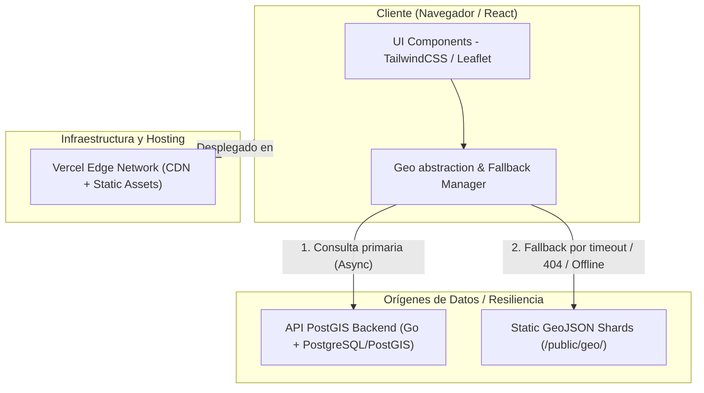
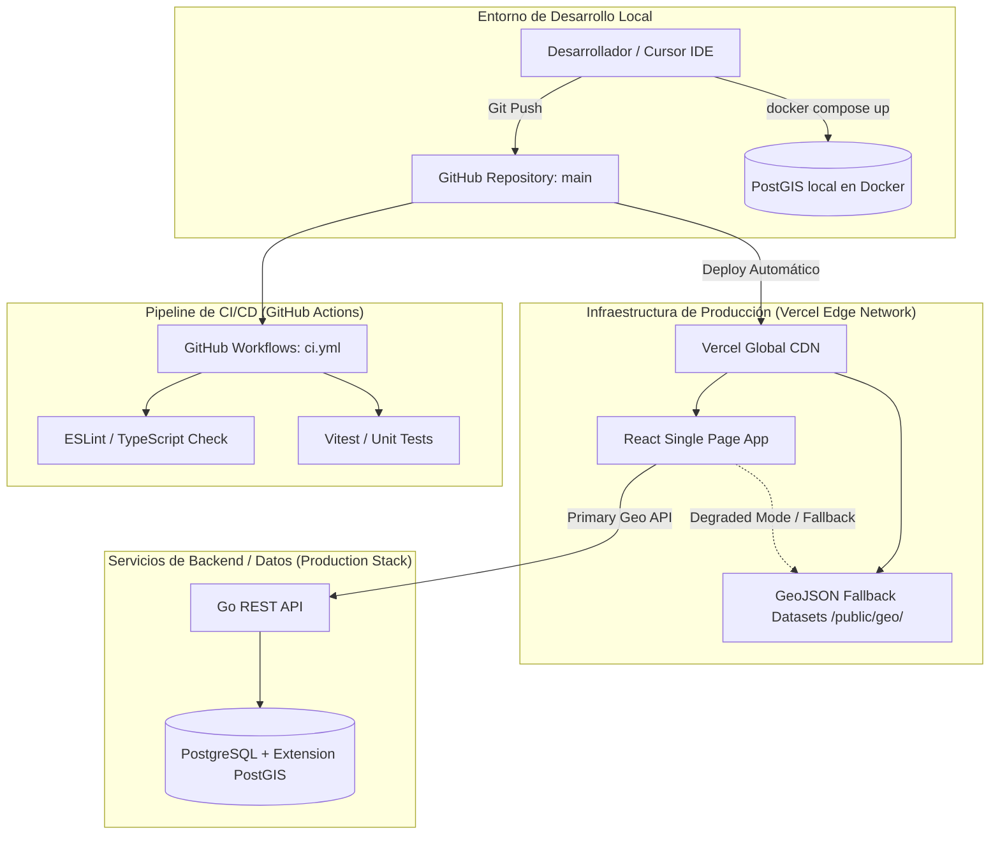
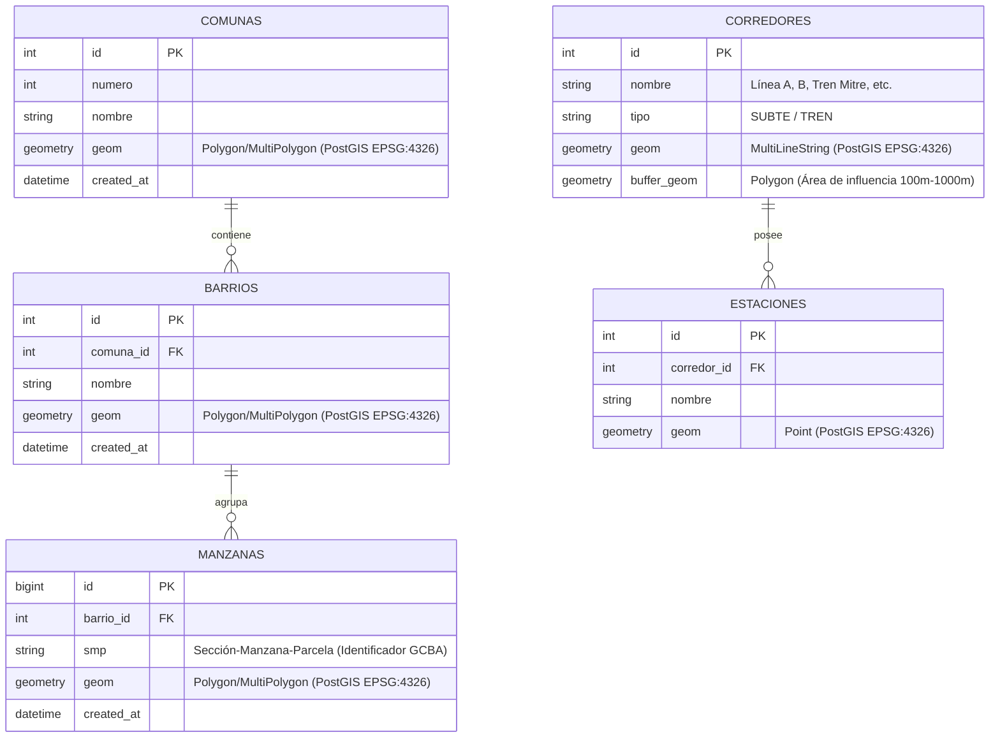

## Índice

0. [Ficha del proyecto](#0-ficha-del-proyecto)
1. [Descripción general del producto](#1-descripción-general-del-producto)
2. [Arquitectura del sistema](#2-arquitectura-del-sistema)
3. [Modelo de datos](#3-modelo-de-datos)
4. [Especificación de la API](#4-especificación-de-la-api)
5. [Historias de usuario](#5-historias-de-usuario)
6. [Tickets de trabajo](#6-tickets-de-trabajo)
7. [Pull requests](#7-pull-requests)

---

## 0. Ficha del proyecto

### 0.1. Tu nombre completo: **[Darío Bublitz](https://www.linkedin.com/in/dario-bublitz/)**

### 0.2. Nombre del proyecto: **RE/MAX Urbana – Prototipo B+C+ (Geo & AI Hub)**

### 0.3. Descripción breve del proyecto: **Plataforma web interactiva para la delimitación geográfica de zonas de interés inmobiliario en CABA (Comunas, Barrios, Corredores de transporte y Manzanas). Incluye un motor de tolerancia a fallos (fallback GeoJSON) para funcionar en entornos serverless sin conexión activa a la base de datos PostGIS.**

### 0.4. URL del proyecto: **https://urbana.wechat.com.ar**

> Puede ser pública o privada, en cuyo caso deberás compartir los accesos de manera segura. Puedes enviarlos a [alvaro@lidr.co](mailto:alvaro@lidr.co) usando algún servicio como [onetimesecret](https://onetimesecret.com/).

### 0.5. URL o archivo comprimido del repositorio https://github.com/matematicaencomputacion/remax-urbana-hub

> Puedes tenerlo alojado en público o en privado, en cuyo caso deberás compartir los accesos de manera segura. Puedes enviarlos a [alvaro@lidr.co](mailto:alvaro@lidr.co) usando algún servicio como [onetimesecret](https://onetimesecret.com/). También puedes compartir por correo un archivo zip con el contenido


---

## 1. Descripción general del producto

> Describe en detalle los siguientes aspectos del producto:

### **1.1. Objetivo:**

> Resolver la rigidez de las búsquedas inmobiliarias tradicionales basadas en radios circulares o comunas administrativas abstractas. RE/MAX Urbana Hub aporta un valor diferencial a agentes inmobiliarios y clientes al permitirles delimitar zonas de búsqueda reales en CABA basadas en la conectividad urbana, la proximidad a corredores de transporte (subte/tren) y la selección directa de manzanas individuales.

### **1.2. Características y funcionalidades principales:**

> Selección Geoespacial Multinivel: Filtros interactivos que permiten navegar y seleccionar áreas a nivel de Comunas (1 a 15), Barrios oficiales de CABA, Corredores de Transporte (líneas de Subte/Tren) y Manzanas individuales.

Lienzo Interactivo de Polígonos: Renderizado dinámico sobre mapa con capacidad de sumar o restar manzanas y polígonos a la zona de interés activa en tiempo real.

Modo Degradado (Fallback de Resiliencia): Arquitectura con tolerancia a fallos que intercepta las peticiones de red. Si el backend o la base de datos PostGIS no responden, la interfaz conmuta automáticamente a un set de datos GeoJSON estáticos localizados en /public/geo/, garantizando disponibilidad del 100% en entornos serverless como Vercel.

### **1.3. Diseño y experiencia de usuario:**

>  La interfaz está construida sobre un diseño dinámico en dark mode optimizado para la inspección geoespacial, priorizando la fluidez y la usabilidad táctil/clic:

1. Aterrizaje y Selección Macro (Comunas): Al ingresar a la aplicación, el usuario observa el mapa interactivo de CABA con la división oficial de las 15 comunas. Pasar el cursor o hacer clic sobre una comuna resalta de inmediato su geometría oficial.

2. Filtrado Micro (Barrios y Corredores): A través de las pestañas inferiores, el usuario puede alternar la vista hacia Barrios o Corredores de Transporte (líneas de Subte A-H, Trenes Mitre/Sarmiento/Roca). Al seleccionar un corredor, el mapa dibuja automáticamente el área de influencia de hasta 10 cuadras a la redonda.

3. Pintado de Manzanas e Interacción: En el modo Manzanas, el lienzo permite seleccionar polígonos individuales usando herramientas como "Clic sumar", "Polígono sumar", o "Restar", permitiendo armar una zona a medida. Si la API PostGIS no se encuentra disponible, la interfaz notifica de forma transparente la activación del dataset estático GeoJSON local sin interrumpir la navegación.

(Captura de pantalla mostrando la selección general por comunas y corredores de transporte)

### **1.4. Instrucciones de instalación:**
> 1.4.1. Prerrequisitos:
 * Node.js (v18.x o superior)

 * npm o pnpm / yarn

>1.4.2. Pasos para la instalación y ejecución en local:
1. Clonar el repositorio:

```Bash
git clone https://github.com/matematicaencomputacion/remax-urbana-hub.git
cd remax-urbana-hub
```
2. Instalar dependencias del proyecto:
```
Bash
npm install
```
3. Configuración de variables de entorno:
Copiá el archivo de ejemplo para crear tu configuración personal:
```
Bash
cp .env.example .env.local
```
>(Nota: Si no se configura una URL de API PostGIS en VITE_GEO_API_BASE, la aplicación conmutará automáticamente al Modo Degradado / Fallback, cargando los archivos GeoJSON estáticos localizados en /public/geo/).

4. Iniciar el servidor de desarrollo:
```
Bash
npm run dev
```
>La aplicación quedará disponible en http://localhost:5173. http://localhost:3333.

5. Compilación para producción (Opcional):
Para generar el bundle optimizado y verificar el build localmente:
```
Bash
npm run build
npm run preview
```
---

## 2. Arquitectura del Sistema

### **2.1. Diagrama de arquitectura:**
>



### **2.2. Descripción de componentes principales:**

> 2.2.1. Interface de Usuario (Frontend):

* Tecnologías: React 18, Vite, TailwindCSS, Lucide Icons.

* Responsabilidad: Proporcionar una SPA (Single Page Application) moderna, reactiva y en dark mode. Gestionar la interacción directa del usuario con los filtros de búsqueda, selección de capas (Comunas, Barrios, Corredores y Manzanas) y herramientas de pintado interactivo de polígonos.

>2.2.2. Motor de Mapas e Interacción Geoespacial:

* Tecnologías: Leaflet / Mapbox GL JS, GeoJSON Engine.

* Responsabilidad: Renderizado vectorial dinámico de polígonos e hilos de transporte sobre el mapa interactivo CABA. Manejo del estado local para áreas sumadas/restadas y dibujo de buffers (radios de tolerancia) en corredores de transporte.

>2.2.3. Capa de Resiliencia / Fallback Manager:

* Tecnologías: JavaScript/TypeScript (Fetch Client + Middleware local).

* Responsabilidad: Interceptar las solicitudes de red dirigidas al servidor geoespacial. Implementa una estrategia de tolerancia a fallos: si la conexión con la base de datos o API PostGIS expira o falla, conmuta de forma transparente hacia los datasets GeoJSON en la carpeta /public/geo/.

>2.2.4. Servidor de Datos Espaciales / Backend (Entorno Completo):
* Tecnologías: Go (Golang), PostgreSQL + Extensión PostGIS.

* Responsabilidad: Procesamiento de consultas geoespaciales complejas (intersecciones de polígonos, cálculo de distancias y agregación de parcelas por comuna o barrio) con respuesta en formato GeoJSON estandarizado.

>2.2.5. Infraestructura de Despliegue:

* Tecnologías: Vercel Edge Network, GitHub CI/CD.

* Responsabilidad: Alojamiento, distribución global de assets estáticos y archivos GeoJSON a través de CDN, permitiendo integración continua directa desde la rama main del repositorio.

### **2.3. Descripción de alto nivel del proyecto y estructura de ficheros**

 El repositorio está organizado bajo una estructura monorepo profesional, separando claramente el código fuente del cliente (React + TypeScript), el servicio de backend (Go/PostGIS), los insumos geoespaciales (GeoJSON), la base de datos y la documentación técnica.
> 2.3.1. Estructura del proyecto:
```text
remax-urbana-hub/
├── .github/
│   └── workflows/ci.yml       # Workflows de Integración Continua (CI)
├── backend/                   # Servicio Backend en Go (API REST Espacial)
│   ├── cmd/                   # Puntos de entrada de los binarios
│   ├── internal/              # Lógica interna de negocio y handlers de PostGIS
│   ├── go.mod                 # Módulo y dependencias de Go
│   └── README.md
├── data/                      # Raw GeoJSON insumos originales (GCBA)
├── db/
│   └── init/                  # Scripts de migración SQL para PostGIS (001–015)
├── docker/
│   └── postgis/               # Configuración de contenedores Docker para PostGIS local
├── docs/                      # Documentación de arquitectura (SDD 00–20, PRD, ADRs)
├── openspec/                  # Especificaciones abiertas y registros de cambios
├── prompts/                   # Prompts y configuraciones de IA / LLM (setter-digital.md)
├── public/
│   └── geo/                   # Datasets GeoJSON estáticos (Modo Degradado / Fallback)
│       ├── manzanas-fallback/ # Shards estáticos de manzanas
│       ├── siluetas/          # Geometrías de comunas y barrios
│       └── proximidad-*.json  # Capas de influencia de transporte
├── runbooks/                  # Guías operativas y de despliegue
├── scripts/                   # Scripts de procesamiento de datos geoespaciales y utilidades
├── src/                       # Código fuente del Frontend (React + TypeScript)
│   ├── components/            # Componentes de UI y capas de visualización
│   ├── gis/                   # Motores de cálculo espacial y conmutación de fallback
│   ├── App.tsx                # Componente raíz de la aplicación
│   └── engine-simulator.ts   # Simulador de motor geoespacial
├── docker-compose.yml         # Orquestación local para servicios y PostGIS
├── package.json               # Dependencias de Node, scripts (npm run stack, build)
├── vite.config.ts             # Configuración del empaquetador Vite (TypeScript)
└── README.md                  # Documentación principal de la entrega
```
>2.3.2. Propósito de los componentes clave:
* src/ & public/geo/: Albergan la aplicación React 18 con TypeScript y los datasets de resiliencia local (siluetas, manzanas y proximidad). Permiten que la interfaz opere en modo offline-first o serverless sin caídas.
* backend/ & db/: Contienen el servidor REST escrito en Go y los scripts de migración para PostgreSQL con la extensión espacial PostGIS active.

* docker/ & docker-compose.yml: Garantizan un entorno de desarrollo local reproducible para levantar la base de datos geográfica con un solo comando.

* docs/ & prompts/: Almacenan la especificación técnica de arquitectura (SDD) y las instrucciones utilizadas para la asistencia con modelos de lenguaje.

### **2.4. Infraestructura y despliegue**

> 2.4.1. Diagrama de Infraestructura y Pipeline CI/CD:

>2.4.2. Proceso de Despliegue:
  2.4.2.1. Desarrollo y Orquestación Local:

* El desarrollo local se realiza sobre un entorno containerizado utilizando Docker Compose (docker-compose.yml), el cual levanta una instancia de PostgreSQL con la extensión PostGIS y las migraciones iniciales (db/init/).

  2.4.2.2. Integración Continua (CI):

    * Cada push a la rama main dispara la ejecución automática del flujo definido en .github/workflows/ci.yml.
    
    * Se evalúan las reglas de calidad de código con ESLint, se compila TypeScript para asegurar compatibilidad de tipos y se ejecutan las pruebas unitarias con Vitest.

  2.4.2.3. Despliegue Continuo (CD) en Vercel:

    * El proyecto se encuentra vinculado directamente a la plataforma Vercel.
    
    * Ante la aprobación del flujo de CI, Vercel compila la SPA React/Vite de forma automática y distribuye los assets estáticos a través de su CDN global.

  2.4.2.4. Estrategia de Despliegue en Modo Resiliente (Degraded Mode):

    * Los conjuntos de datos GeoJSON de soporte localizados en /public/geo/ (siluetas, manzanas y corredores) se despliegan junto al bundle estático del frontend.
    
    * Si la API primaria de backend en Go o la base de datos PostGIS no están alcanzables (por ejemplo, en demostraciones públicas o servidores serverless de capa gratuita), la aplicación conmuta su capa de datos al modo estático sin interrumpir la sesión ni la experiencia del usuario.

### **2.5. Seguridad**

> Se han aplicado prácticas de seguridad fundamentales tanto en la gestión de la infraestructura como en el desarrollo del frontend y backend:

2.5.1. Aislamiento de Credenciales y Variables de Entorno:
Las URL de APIs sensibles y claves de acceso no se hardcodean en el código fuente. Se gestionan mediante archivos de configuración .env (siguiendo la plantilla .env.example). En producción (Vercel), las variables se inyectan de forma segura desde el panel de control del proveedor.

2.5.2. Saneamiento de Consultas Geoespaciales y SQL Injection Prevention:
Las consultas espaciales a la base de datos PostgreSQL/PostGIS a través del servicio en Go utilizan prepared statements y parámetros parametrizados, evitando la concatenación directa de cadenas enviadas por el usuario en las coordenadas o filtros.

2.5.3. Validación de Tipos y Parsing Estricto (TypeScript):
En el frontend, la deserialización de los archivos GeoJSON y respuestas REST se realiza bajo un tipado estricto con TypeScript. Esto evita la inyección de propiedades maliciosas o errores de ejecución (runtime) por objetos no estructurados.

2.5.4. Principio de Mínimo Privilegio en CI/CD:
Los flujos de GitHub Actions (ci.yml) ejecutan únicamente permisos de lectura sobre el repositorio para los trabajos de compilación y testing, protegiendo los tokens de despliegue en los secretos del repositorio.

### **2.6. Tests**

> Se ha implementado una estrategia de pruebas automáticas focalizada en la resiliencia de la capa geoespacial y la integridad de las variables de entorno:

2.6.1. Pruebas Unitarias de Configuración (geoApi.env.test.ts):
Evaluación mediante Vitest para verificar la correcta resolución de variables de entorno cliente (VITE_GEO_API_BASE). Se valida que el cliente HTTP active o desactive el modo fallback de forma predecible según la disponibilidad de la URL configurada.

2.6.2. Validación de Archivos de Fallback (GeoJSON Schema):
Tests de integración livianos que comprueban la presencia, estructura válida y formato GeoJSON correcto (FeatureCollection) de los shards locales almacenados en /public/geo/ (siluetas de comunas/barrios y manzanas), asegurando que el modo degradado no falle en ejecución.

2.6.3. Chequeo de Tipos y Linter en Pipeline (CI):
Validación estática automatizada en GitHub Actions (npm run check / tsc / eslint) para garantizar la ausencia de errores de tipado o inconsistencias antes de cada despliegue.


## 3. Modelo de Datos

### **3.1. Diagrama del modelo de datos:**



### **3.2. Descripción de entidades principales:**

#### **1. Entidad: `COMUNAS`**
Representa la división política de primer nivel de la Ciudad Autónoma de Buenos Aires (15 comunas).

* **Atributos:**
  * `id` (`INT`, Primary Key, Auto-increment, `NOT NULL`): Identificador único de la comuna.
  * `numero` (`INT`, `UNIQUE`, `NOT NULL`): Número oficial de la comuna (1 a 15).
  * `nombre` (`VARCHAR(100)`, `NOT NULL`): Nombre o denominación oficial de la comuna.
  * `geom` (`GEOMETRY(Polygon/MultiPolygon, 4326)`, `NOT NULL`): Polígono espacial del límite comunal en coordenadas geográficas WGS84.
  * `created_at` (`TIMESTAMP`, Default `CURRENT_TIMESTAMP`): Fecha de alta del registro.
* **Relaciones:**
  * **Relación con `BARRIOS` (1:N):** Una comuna contiene uno o varios barrios. La clave primaria `COMUNAS.id` se referencia en `BARRIOS.comuna_id`.

---

#### **2. Entidad: `BARRIOS`**
Representa la división oficial por barrios porteños dentro de cada comuna (48 barrios oficiales).

* **Atributos:**
  * `id` (`INT`, Primary Key, Auto-increment, `NOT NULL`): Identificador único del barrio.
  * `comuna_id` (`INT`, Foreign Key `COMUNAS(id)`, `NOT NULL`): Referencia a la comuna a la que pertenece el barrio.
  * `nombre` (`VARCHAR(100)`, `NOT NULL`): Nombre oficial del barrio (ej: Palermo, Recoleta, Belgrano).
  * `geom` (`GEOMETRY(Polygon/MultiPolygon, 4326)`, `NOT NULL`): Polígono espacial de la geometría del barrio.
  * `created_at` (`TIMESTAMP`, Default `CURRENT_TIMESTAMP`): Fecha de creación del registro.
* **Relaciones y Restricciones:**
  * **FK `comuna_id`:** `ON DELETE CASCADE` / `ON UPDATE CASCADE`.
  * **Relación con `MANZANAS` (1:N):** Un barrio agrupa múltiples manzanas geográficas.

---

#### **3. Entidad: `MANZANAS`**
Representa la unidad básica de catastro y parcelado urbano (manzana/polígono individual).

* **Atributos:**
  * `id` (`BIGINT`, Primary Key, Auto-increment, `NOT NULL`): Identificador interno del polígono de manzana.
  * `barrio_id` (`INT`, Foreign Key `BARRIOS(id)`, `NULLABLE`): Referencia al barrio correspondiente.
  * `smp` (`VARCHAR(50)`, `NULLABLE`): Código de Sección-Manzana-Parcela según el mapa catastral de GCBA.
  * `geom` (`GEOMETRY(Polygon/MultiPolygon, 4326)`, `NOT NULL`): Geometría detallada del perímetro de la manzana.
  * `created_at` (`TIMESTAMP`, Default `CURRENT_TIMESTAMP`): Fecha de ingesta del dato.
* **Relaciones e Índices:**
  * **FK `barrio_id`:** `ON DELETE SET NULL`.
  * **Índice Espacial (`GIST` en PostGIS):** Creado sobre `geom` (`CREATE INDEX idx_manzanas_geom ON MANZANAS USING GIST(geom);`) para acelerar las consultas de intersección y pintado directo.

---

#### **4. Entidad: `CORREDORES`**
Representa los ejes de transporte público masivo (Líneas de Subte A-H y líneas de Ferrocarril urbano).

* **Atributos:**
  * `id` (`INT`, Primary Key, Auto-increment, `NOT NULL`): Identificador del trazado.
  * `nombre` (`VARCHAR(100)`, `NOT NULL`): Nombre de la línea (ej: "Línea A", "Tren Mitre").
  * `tipo` (`VARCHAR(20)`, `NOT NULL`, Check: `'SUBTE'` o `'TREN'`): Clasificación del medio de transporte.
  * `geom` (`GEOMETRY(MultiLineString, 4326)`, `NOT NULL`): Traza lineal de las vías o túneles.
  * `buffer_geom` (`GEOMETRY(Polygon, 4326)`, `NULLABLE`): Polígono calculado del área de influencia o distancia de caminabilidad a la traza (ej: radio de 100m a 1000m).
* **Relaciones:**
  * **Relación con `ESTACIONES` (1:N):** Un corredor posee múltiples estaciones de parada.

---

#### **5. Entidad: `ESTACIONES`**
Representa los puntos fijos de acceso (estaciones de subte y trenes) distribuidos a lo largo de un corredor.

* **Atributos:**
  * `id` (`INT`, Primary Key, Auto-increment, `NOT NULL`): Identificador único de la estación.
  * `corredor_id` (`INT`, Foreign Key `CORREDORES(id)`, `NOT NULL`): Referencia a la línea de transporte.
  * `nombre` (`VARCHAR(100)`, `NOT NULL`): Nombre de la estación (ej: "Plaza Italia", "Retiro").
  * `geom` (`GEOMETRY(Point, 4326)`, `NOT NULL`): Coordenadas geográficas puntuales (latitud/longitud) de la estación.
* **Relaciones e Índices:**
  * **FK `corredor_id`:** `ON DELETE CASCADE`.
  * **Índice Espacial (`GIST`):** Aplicado sobre `geom` para permitir búsquedas de proximidad por radio (ej: manzanas a menos de 500 metros de una estación)..

---

## 4. Especificación de la API

La API Backend del proyecto (escrita en Go y conectada a la base de datos PostGIS) expone servicios REST para la consulta y cálculo de geometrías espaciales en formato estandarizado **GeoJSON**.

---

### **4.1. Definición OpenAPI 3.0 (Endpoints principales):**

```yaml
openapi: 3.0.3
info:
  title: Remax Urbana Hub - Geo API
  description: API REST geoespacial para la consulta de capas catastrales y cálculo de proximidad en CABA.
  version: 1.0.0
paths:
  /api/v1/geo/barrios:
    get:
      summary: Obtener geometrías de barrios
      description: Retorna los polígonos de los barrios de CABA, opcionalmente filtrados por Comuna.
      parameters:
        - name: comuna
          in: query
          required: false
          schema:
            type: integer
          description: Número de comuna para filtrar (1-15)
      responses:
        '200':
          description: Colección de features GeoJSON de barrios
          content:
            application/json:
              schema:
                $ref: '#/components/schemas/GeoJSONFeatureCollection'

  /api/v1/geo/manzanas:
    get:
      summary: Obtener manzanas por bounding box o barrio
      description: Devuelve el parcelado catastral filtrado por identificador de barrio o por coordenadas de visor.
      parameters:
        - name: barrio_id
          in: query
          required: true
          schema:
            type: integer
          description: ID único del barrio
      responses:
        '200':
          description: Colección GeoJSON con los polígonos de las manzanas
          content:
            application/json:
              schema:
                $ref: '#/components/schemas/GeoJSONFeatureCollection'

  /api/v1/geo/proximidad/corredor:
    get:
      summary: Consultar área de influencia de transporte
      description: Retorna el polígono de buffer (área de caminabilidad) según el corredor seleccionado y un radio en metros.
      parameters:
        - name: corredor_id
          in: query
          required: true
          schema:
            type: integer
          description: ID del corredor (Línea A, Mitre, etc.)
        - name: radio_m
          in: query
          required: false
          schema:
            type: integer
            default: 500
          description: Radio de buffer en metros (100 - 1000)
      responses:
        '200':
          description: Polígono GeoJSON con la zona buffer calculada por PostGIS
          content:
            application/json:
              schema:
                $ref: '#/components/schemas/GeoJSONFeature'

components:
  schemas:
    GeoJSONFeatureCollection:
      type: object
      properties:
        type:
          type: string
          example: FeatureCollection
        features:
          type: array
          items:
            $ref: '#/components/schemas/GeoJSONFeature'
    GeoJSONFeature:
      type: object
      properties:
        type:
          type: string
          example: Feature
        geometry:
          type: object
          properties:
            type:
              type: string
              example: Polygon
            coordinates:
              type: array
              items:
                type: array
        properties:
          type: object
```
### 4.2. Ejemplo de petición y respuesta:
Petición (GET /api/v1/geo/barrios?comuna=14):
```yaml
Bash
curl -X 'GET' \
  'http://localhost:8080/api/v1/geo/barrios?comuna=14' \
  -H 'accept: application/json'
```
Respuesta exitosa (200 OK):
```
JSON
{
  "type": "FeatureCollection",
  "features": [
    {
      "type": "Feature",
      "id": 14,
      "geometry": {
        "type": "Polygon",
        "coordinates": [
          [
            [-58.4252, -34.5781],
            [-58.4111, -34.5892],
            [-58.4310, -34.5950],
            [-58.4252, -34.5781]
          ]
        ]
      },
      "properties": {
        "id": 14,
        "nombre": "Palermo",
        "comuna_id": 14
      }
    }
  ]
}
```
---

## 5. Historias de Usuario

> 5.1. Historia de Usuario 1: Selección Multizona y Ajuste Fino Catastral (Sumar/Restar Manzanas)
 * Título: Evaluación simultánea de zonas equivalentes y personalización de polígonos a nivel de manzana.

 * Como: Buscador de vivienda / Comprador inmobiliario.

 * Quiero: Seleccionar simultáneamente múltiples zonas de análisis (ej. la delimitación de un barrio como Recoleta/Barrio Norte y el buffer de transporte de la estación Congreso de Tucumán - Subte D) y ajustar el polígono final agregando o quitando manzanas individuales.

 * Para: Comparar alternativas de ubicación equivalentes para mi decisión de compra y descartar microzonas o manzanas específicas dentro de un barrio donde no deseo vivir.

 * Criterios de Aceptación:

    5.1.2. Dado que el usuario activa la herramienta de selección, cuando marca el barrio "Recoleta" y la zona de influencia (buffer) del "Subte D - Congreso de Tucumán", entonces el mapa debe mostrar ambas regiones activas en pantalla de forma equivalente para su análisis.
    
    5.1.3. Dado que el usuario está analizando la zona de Recoleta, cuando activa la herramienta de Ajuste Fino (Herramienta de Sumar/Restar Manzanas) y hace clic sobre manzanas específicas, entonces el sistema debe incluir o excluir del polígono de interés las parcelas seleccionadas.
    
    5.1.4. La interfaz debe actualizar en tiempo real el área catastral resultante y resaltar las manzanas activas frente a las excluidas, garantizando que los filtros de búsqueda se apliquen estrictamente sobre la geometría personalizada por el usuario.

>5.2. Historia de Usuario 2: Triage Documental y Matriz de Responsabilidades Compartidas (Venta y Captación)
Título: Verificación de documentación de venta, asignación de responsabilidades y seguimiento en tiempo real.

 * Como: Propietario Vendedor (Cliente Riguroso).

 * Quiero: Realizar un triage digital de la documentación requerida para la venta de mi inmueble, obtener una matriz clara de responsabilidades individuales (qué debe gestionar el cliente y qué asume el agente de Urbana) y visualizar el calendario de compromisos en la app y por WhatsApp.

 * Para: Garantizar la transparencia del contrato con la inmobiliaria, evitar demoras normativas y tener trazabilidad total sobre los tiempos de respuesta y cumplimiento de cada parte.

 * Criterios de Aceptación:

    5.2.1. Dado que el agente y el propietario inician el proceso de captación, cuando completan el Triage Documental en la app, entonces el sistema debe generar automáticamente el inventario de documentos (título, planos, COTI, expensas) clasificándolos entre "Aprobados", "Pendientes Cliente" y "Gestión Agente".
    
    5.2.2. Dado que se finaliza el triage, cuando el cliente confirma el acuerdo, entonces la app debe permitir descargar/exportar en el acto el documento con la Matriz de Responsabilidades Individuales y los SLA (tiempos de respuesta prometidos).
    
    5.2.3. Dado que hay tareas pendientes con fechas límite, cuando transcurre el flujo operativo, entonces el sistema debe sincronizar el calendario entre la app y las notificaciones automatizadas vía n8n/WhatsApp, mostrando a ambas partes el estado de avance en tiempo real.

   

>5.3. Historia de Usuario 3: Operación Encadenada (Venta por Tracto Abreviado y Selección Progresiva de "Zona de Vida")
Título: Gestión simultánea de venta condicionada por sucesión y definición iterativa de zonas de compra seguras.

* Como: Cliente Propietario/Comprador (+70 años).

* Quiero: Tramitar la documentación para la venta de mi inmueble (requiriendo sucesión por tracto abreviado) y, en paralelo, definir semana a semana junto a mi agente inmobiliario una "Zona de Vida" acumulativa agregando barrios con criterios de seguridad.

* Para: Garantizar la viabilidad legal de la venta de mi propiedad y elegir con acompañamiento profesional y progresivo una zona segura para mi nueva vivienda sin abrumarme con el proceso tecnológico.

* Criterios de Aceptación:

    5.3.1. Dado que el inmueble a vender requiere tramitación especial, cuando se da de alta la propiedad en la app, entonces el módulo de Triage Documental debe activar la lista de chequeo específica para "Sucesión por Tracto Abreviado", definiendo los hitos legales y el estado de avance.
    
    5.3.2. Dado que el cliente revisa las opciones de compra en reuniones periódicas con el agente, cuando evalúan un nuevo barrio que cumple con sus estándares de seguridad, entonces al presionar la acción destacada ("Añadir a Zona de Vida" / Botón Rojo), el sistema debe integrar la geometría del nuevo barrio a su mapa acumulativo de búsqueda.
    
    5.3.3. Dado que la operación es encadenada, cuando el usuario accede a su panel, entonces la app debe mostrar un tablero unificado con dos compromisos de trabajo semanales: el progreso de la venta/tracto abreviado y la consolidación de su Zona de Vida para la compra.


---

## 6. Tickets de Trabajo

>
Formato estandarizado para GitHub Issues / Jira. Derivados de la hoja de ruta y del estado MVP (julio 2026): handoff transaccional, lista sincronizada e inventario geoespacial de propiedades.

### 6.1. TICKET-BE-01 — Handoff real Zona de Vida → Outbox (Go)
* Tipo: Backend (Go)

* Historia: HU-08

* Prioridad: P0 (Alta)

* Estimación: 5 Story Points

* Labels: backend, go, outbox, handoff

### Contexto:
Hoy la Zona de Vida se confirma en el selector y puede persistirse vía PUT …/zona-de-vida, pero el handoff con paquete de contexto hacia n8n/agentes sigue en estado objetivo (TARGET): el contrato de dominio existe y el relay de outbox ya ejecuta, pero falta cerrar el circuito "confirmó zona → evento de handoff durable → entrega observable". Sin esto no hay demostración End-to-End (E2E) de que el lead quedó listo para el agente humano.

### Tareas Técnicas:
  1. Definir y alinear el payload v1 de handoff (interesado_id, geometría/resumen zona, rol, origen, descriptores.presentacion_*) contra docs/data/schemas y la especificación OpenAPI.
  
  2. En el handler de zona-de-vida, tras persistir la geometría: insertar la fila correspondiente en la tabla outbox dentro de la misma transacción de base de datos que el upsert de la zona.
  
  3. Asegurar la idempotencia del evento mediante clave natural (event_id) y el manejo estricto de estados pending → published | parked.
  
  4. Desarrollar pruebas unitarias y de integración para el repositorio y handler (verificación de tabla outbox y rollback automático si falla la inserción del evento).
  
  5. Ejecutar smoke test manual: backend:api + relay → n8n/stdout; documentar en runbook operativo.

### Criterios de Aceptación (Given / When / Then):
* Dado que existe un interesado demo con la API Go ejecutándose y PostGIS migrado, cuando el cliente envía un PUT /api/v1/interesados/{id}/zona-de-vida con una geometría válida, entonces debe crearse 1 fila outbox con estado pending (o published si el relay ya procesó) conteniendo un envelope válido contra el schema de handoff dentro de la misma transacción.

* Dado que se envía un payload de zona inválido (GeoJSON malformado), when se invoca el mismo endpoint, then la API responde con código HTTP 4xx, no crea registros en outbox y no deja la zona parcialmente escrita en base de datos.

* Dado que el relay se encuentra activo y con un webhook configurado, when existe un evento de handoff pendiente, then el evento transiciona a published (o a parked con last_error detallado si el destino falla) sin duplicar envíos ante reintentos.

### Archivos Involucrados:
* backend/cmd/api/main.go

* backend/internal/zonavida/handler.go

* backend/internal/zonavida/repository.go

* backend/internal/zonavida/repository_test.go

* backend/internal/outbox/outbox.go · publisher.go

* backend/cmd/outbox-relay/main.go

* db/init/007_handoffs_outbox.sql · 008_outbox_backoff_parking.sql

* docs/data/openapi.v1.yaml · docs/data/schemas/

* docs/architecture/13-domain-events.md · 14-handoffs-mejorados-predictive.md

* runbooks/outbox-parked.md

### 6.2. TICKET-FE-01 — Lista sincronizada de recomendaciones ↔ mapa (React/TypeScript)
* Tipo: Frontend (React / TypeScript)

* Historia: H3 / Lista sincronizada (MVP)

* Prioridad: P1 (Media-Alta)

* Estimación: 5 Story Points

* Labels: frontend, gis, recomendador, ux

### Contexto:
El selector geográfico y el choropleth/score de zona ya se encuentran funcionales. Se requiere habilitar la vista dual lista ↔ mapa: propiedades recomendadas dentro de la zona confirmada, interacción hover/selección sincronizada entre ambos componentes y filtros mínimos (precio, ambientes) respetando la respuesta real o del contrato OpenAPI.

### Tareas Técnicas:
1. Diseñar el panel de lista (mostrando precio, ambientes, score de ajuste y razones de recomendación) dispuesto junto o debajo del mapa Leaflet en el flujo post-confirmación.

2. Consumir el servicio POST /recomendador/buscar-en-zona tipado de forma estricta mediante el esquema OpenAPI.

3. Sincronizar eventos de interfaz: la acción de hover o click en la lista debe activar el resaltado (highlight) de su pin en el mapa y viceversa, aplicando centrado suave (pan/zoom).

4. Implementar controles de filtro UI (precio máximo, ambientes mínimos) con visualización de estado vacío explícito si no hay coincidencia.

5. Desarrollar pruebas unitarias para el mapeo respuesta → vista y pruebas de integración del panel con React Testing Library / jsdom.

### Criterios de Aceptación (Given / When / Then):
* Dado que se tiene una Zona de Vida confirmada con manzana_ids o geometría en el store, when se abre la vista de recomendaciones, then se renderizan N propiedades en la lista y N pines en el mapa asociados 1:1 por propiedad_id.

* Dado que la lista y el mapa están visibles en pantalla, when el usuario pasa el cursor (hover) o enfoca una propiedad de la lista, then el pin correspondiente en el mapa se destaca visualmente y el visor realiza un centrado suave hacia sus coordenadas.

* Dado que se aplican filtros de precio o ambientes, when no se obtienen coincidencias, then la interfaz muestra un estado vacío informativo (sin pines erróneos) y permite limpiar los filtros con una sola acción.

* Dado que el usuario marca un inmueble como favorito, when recarga la aplicación o conmuta entre las pestañas del sistema, then la selección permanece almacenada en el estado persistente.

### Archivos Involucrados:
* src/App.tsx

* src/gis/components/PresentacionSelectorGeografico.tsx

* src/gis/components/ZonasDeVidaMap.tsx

* src/gis/store/zonaVidaStore.ts · src/gis/hooks/useZonaVida.ts

* src/gis/lib/zonaVidaApi.ts

* src/gis/types/index.ts

* docs/data/openapi.v1.yaml

* docs/architecture/05-motor-geo-recomendador.md · 15-arquitectura-frontend-gis-zonas-vida.md

* Pruebas bajo src/gis/**/*.test.tsx

### 6.3. TICKET-DB-01 — Inventario de propiedades geo-indexadas (PostgreSQL / PostGIS)
* Tipo: Base de Datos (PostgreSQL / PostGIS)

* Historia: Inventario de propiedades (Habilitador para H3 y recomendador)

* Prioridad: P1 (Media-Alta)

* Estimación: 4 Story Points

* Labels: db, postgis, migracion, recomendador

### Contexto:
Se cuenta con las migraciones catastrales de barrios, manzanas y trazas de transporte, pero se requiere disponer del inventario de propiedades con geometría puntual indexada para realizar consultas espaciales (ST_Intersects, ST_DWithin) contra las Zonas de Vida de los interesados.

### Tareas Técnicas:
1. Crear el script de migración db/init/016_propiedades_inventario.sql definiendo la tabla propiedades (id, precio, ambientes, amenities jsonb, geom geography(Point,4326), barrio_id, activo).

2. Definir un índice espacial GIST sobre la columna geom y un índice B-tree sobre los campos (activo, precio, ambientes).

3. Crear el script de datos iniciales (seed/fixture) con al menos 20 propiedades distribuidas en barrios de CABA (Belgrano, Palermo, Núñez).

4. Escribir la función SQL para la búsqueda por zona que tome como parámetro la geometría GeoJSON o lista de manzanas y retorne las propiedades contenidas ordenadas por distancia/score.

5. Actualizar la documentación en docs/3-modelo-de-datos.md y sincronizar los esquemas en la especificación OpenAPI.

### Criterios de Aceptación (Given / When / Then):
* Dado que se ejecuta el proceso de migraciones sobre una base de datos limpia, when se aplica la migración 016, then se crean la tabla e índices espaciales correctamente verificables vía consultas del cliente PostgreSQL.

* Dado que la base de datos cuenta con el seed de propiedades, when se invoca una función de distancia o intersección espacial (ST_DWithin / ST_Intersects) sobre un polígono delimitado, then retorna las propiedades activas cuyos puntos geográficos se ubican dentro del perímetro.

* Dado que se pasa un identificador de Zona de Vida con manzanas asignadas, when se ejecuta la consulta de propiedades en zona, then el resultado entregado es determinista y consistente entre ejecuciones.

* Dado que se ejecutan las pruebas de integración en el pipeline de CI, when corre el contenedor con PostGIS, then se valida la correcta creación del esquema y la respuesta de las funciones de búsqueda espacial.

### Archivos Involucrados:
* db/init/016_propiedades_inventario.sql (Nuevo)

* db/init/004_recomendador.sql

* scripts/db-migrate.mjs · scripts/lib/db-env.mjs

* docs/3-modelo-de-datos.md

* docs/architecture/05-motor-geo-recomendador.md · 09-esquema-bd-postgis-qdrant.md

* docs/data/openapi.v1.yaml · docs/data/fixtures/

### Orden Sugerido de Ejecución:
```text
Plaintext
TICKET-DB-01 (Base de Datos / PostGIS)
       │
       ├───► TICKET-BE-01 (Backend Go - Outbox / Handoff)
       │
       └───► TICKET-FE-01 (Frontend React - Lista ↔ Mapa)
```


---

## 7. Pull Requests

> Documenta 3 de las Pull Requests realizadas durante la ejecución del proyecto

**Pull Request 1**

**Pull Request 2**

**Pull Request 3**

